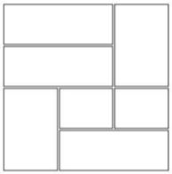
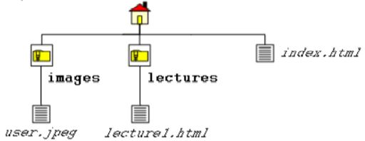

# Assignment questions
## 1 HTML introduction
1. **What does the server in the client server architecture do?**  
    The server provides a service to one or many clients after the clients initiate requests for given services. Servers are classified by the services they provide, like web servers or file servers.
2. **What does the client do?**  
    The client in a client-server model initiates requests to the server for a service, usually through a network.
3. **What is an IP address?**  
    An IP address (short for Internet Protocol address) is used to identify computers on the Internet. It works like a return address would on a piece of mail. When your computer or device sends a request, like a search on Google, it tags the request with your IP address. That way Google knows where to send the response with your search results.
4. **What is DNS?**  
    DNS stands for Domain Name System, and is widely referred to being a phone book, translating human-readable names to computer-friendly IP addresses. The entries in this particular phonebook is called DNS records.
5. **What is the difference between the Internet and WWW?**  
    The internet is a massive network of networks connecting billions of devices globally. Information that travels over the internet uses different languages known as protocols. The World Wide Web, or simply 'the web', is a way of accessing information over the internet using the protocol known as HTTP. An example is e-mail, which is widely used and accessed over the web, but travels using a different internet protocol.
6. **Explain what HTML is**  
    HTML stands for HyperText Markup Language and is a set of instructions on how to create a document like a web page. Web browsers read these instructions and displays the web page formatted for the user.

## 2 HTML continued, links/paths & CSS introduction
1. **Why does inline style CSS override rules defined in style elements and external stylesheets?**  
    The more specific the CSS selector is, the higher is the precedence of the CSS property declarations inside the CSS rule owning the selector. In general terms, the more specifically (uniquely) a CSS selector targets an HTML element, the higher is its specificity.
2. **Give a brief example of when to use ID (`#id`) and when to use classes (`.class`) in CSS.**  
    The difference between an ID and a class is that an ID can be used to identify one element, whereas a class can be used to identify more than one. An ID might be used on a webpage navbar, while a class might be used on all paragraphs in an article.
3. **What does RGBA mean and what colors can you express with it?**  
    `Red, Green, Blue, Alpha` is a hexidecimal number for expressing a mix of colors and a percentage of transparency. Regular `RGB` can express 2<sup>24</sup> (16 million) colors, and after adding the `A` value you can also choose the opacity for the chosen color. That results in a wild 2<sup>32</sup> (4 billion) different color values.
4. **Why do we include CSS files inside the head element and not inside the body element?**  
    As a browser reads your HTML from top to bottom, you want your styles to load before the content of your page loads. It is common practice to have all meta/non-content elements of a website in the `<head>`.
5. **What CSS selector matches all the p elements inside the article element in the following HTML?**  
    ```html
    <p>This should not match.</p>
    <article>
        <p>This should match.</p>
        <p>This should also match.</p>
        <p>Do not forget about this one!</p>
    </article>
    ```
    `article p { }`
6. **What are the DRY and KISS principles of software design?**  
    DRY, or `Don't Repeat Yourself`, is a software design principle revolving around using less code in general and reusing code where possible to reduce repetition of software patterns. `Keep It Simple Stupid` is a principle where the main concept is to keep code as simple as possible. Each method, class or function should be clearly named as simple as possible to understand for whoever looks at your code.

## 3 CSS continued
1. **What is the difference between `position: absolute` and `position: fixed`?**  
    Absolute positioning is relative to its parent element, while fixed positioning is relative to the viewport/the browser window.  
2. **With CSS3, how do we access the third element within another element?**  
    The pseudo selector `:nth-child` is made for this, and to access the third element we would use `:nth-child(3)`.

## 4 HTML video & css
1. **Why do mobile phones usually ignore auto play on video elements?**  
    Mobile devices are often limited by cellular data plans so they are set to ignore auto play by default to save data quota.
2. **What will this CSS snippet do if the visitor is browsing on a device with `320x568` resolution?**  
    It will not affect the user as it only affects users within the width range `768px` to `1024px`.  
    ```css
    @media only screen
        and (min-device-width : 768px)
        and (max-device-width : 1024px) {
        #logo {
        display: none;
            }
        }
    ```

3. **Mention some of the advantages of having a single responsive website instead of dedicated versions like `m.til.no` for mobile and `til.no` for desktop?**  
    - Improved user experience with faster web sites
    - No duplicate content
    - Better analytics on how users use your website

## 5 Forms, XML and JavaScript
1. **Why does the following expression `0.1 + 0.2 === 0.3` evaluate to false in Javascript?**  
    Binary float point math with 64 bit representation can't represent denominators which are not a power of 2 accurately, so the actual result of the expression is not `0.3`.
2. **What does the `method` attribute on a `form` element decide?**  
    It specifies the HTTP method on how to submit the form. (GET/POST)
3. **Explain why the form fields appear in the URL when the method on form element is changed to `GET`?**  
    Because HTML is designed to communicate between the client and the server. When the method is changed from `POST` to `GET`, it appends data to the URL instead of storing it within the HTTP request. There are pros and cons to both, but in short, sensitive data should never be used with `GET`, and `POST` requests should be used if you need to send data without length restrictions.
4. **Why is it considered bad practice to only validate form input with HTML5 and/or Javascript?**  
    Validation should always happen both client-side and server-side. Client-side (HTML & Javascript) is mainly to provide a good user experience with instant feedback to user inputs, while server side validation is for security.
5. **When is it appropriate to use `textarea` over `input`?**  
    When the input field requires a paragraph instead of a smaller input message it could be appropriate to use a resizable text area. Here you would probably consider using the method `POST` as well.

## 6 Canvas
1. **When calling `getContext('2d')` on a Canvas element, it will return a drawing context (i.e. the type of canvas) - in this case a two-dimensional context. How can we get a threedimensional context instead?**  
    `let ctx = document.getContext("webgl")`
    
2. **How would you create a blue circle using the Canvas element? Explain with words or code.**  
    ```javascript
    context.beginPath()
    context.arc(100,100,50,0,2*Math.PI) // Draws arc at x=100, y=100, r=50, startAngle = 0, endAngle = 2*PI (full circle)
    context.fillStyle = 'blue'            
    context.fill()
    context.stroke()
    ```

3. **What is a more terse (also known as shorter) way of writing the loop in the following using the `Array.filter` method?**  
    ```javascript
    const countries = ['Norway', 'Sweden', 'Denmark', 'New Zealand'];
    const countriesStartingWithN = [];
    for (let i = 0; i < countries.length; i++) {
            let country = countries[i];
            if (country.startsWith('N')) {
                    countriesStartingWithN.push(country);
            }
    }
    ```
    ```javascript
    const countries = ['Norway', 'Sweden', 'Denmark', 'New Zealand'];
    const shorterCountriesStartingWithN = countries.filter(country => country.startsWith("N"));
    ```

# Exam questions

1. In CSS, you can override precedence rules by adding the ____ property to a style declaration.  
    A. !override  
    B. !main  
    **C. !important**  
    D. !priority  

2. What is the default value of the position property?  
    A. relative  
    B. absolute  
    C. fixed  
    **D. static**  

3. What is one advantage that HTML5 APIs offer for modern Web design?  
    A. They enable users to view Flash content on mobile devices.  
    B. They enable developers to create apps without coding skills  
    C. They enable older browsers to display any multimedia content  
    **D. They enable users to view multimedia without plug-ins**  

4. What is the result of the following code?  
    `var y = Math.floor(3.8);`  
    A. 3.8  
    B. 4  
    C. 3.5  
    **D. 3**  

5. Graphics defined by SVG is in which format?  
    **A. XML**  
    B. HTML  
    C. CSS  
    D. Javascript
    
6. What the following code will do if someone types in “18”?  
    ```javascript
    var age = prompt("Enter your age ");
    var next = age + 1;
    alert("On your next birthday, you'll be "+next);
    ```
    A. It gets an error  
    B. It displays "18"  
    C. It displays "19"  
    **D. It displays "181"**  

7. How do you select all p elements inside a div element?  
    A. `div.p`  
    **B. `div p`**  
    C. `div + p`  
    D. `div * p`  

8. How do you display a border like this:  
    The top border = 10 pixels  
    The bottom border = 5 pixels  
    The left border = 20 pixels  
    The right border = 1 pixel  
    **A. `border-width:10px 1px 5px 20px;`**  
    B. `border-width:5px 20px 10px 1px;`  
    C. `border-width:10px 5px 20px 1px;`  
    D. `border-width:10px 20px 5px 1px;`  

9. From outside to inside, a box (block) has:  
    A. border, margins, padding  
    B. margins, padding, border  
    C. padding, margins, border  
    **D. margins, border, padding**  

10. Which statement is true?  
    **A. An XML document can have one root element**  
    B. An XML document can have one child element  
    C. XML elements have to be in lower case  
    D. All of the above  

11. Which of the following statements is true? (2%)  
    A. JPG files are limited to 256 colors.  
    B. GIF files support 8 bit transparency.  
    C. Use GIF files for photographs.  
    **D. GIF uses lossless compression algorithm**  

12. What is one advantage that HTML5 APIs offer for modern Web design?  
    A. They enable users to view Flash content on mobile devices.  
    B. They enable developers to create apps without coding skills  
    C. They enable older browsers to display any multimedia content  
    **D. They enable users to view multimedia without plug-ins**  

13. Match each of the TCP/IP layers with the correct protocol.  

    |       Layer       	| Protocol 	|
    |:-----------------:	|:--------:	|
    | Application Layer 	| **HTTP** 	|
    | Transport Layer   	| **TCP**  	|
    | Network Layer     	| **IP**   	|
    | Physical Layer    	| **WiFi** 	|

14. What is the correct HTML for making a text input field?  
    ```html
    A. <input type="textfield">
    B. <textfield>
    C. <input type="text">
    D. <textinput type="text">
    ```
    **Answer: C**  

15. How do you display hyperlinks without an underline?  
    ```css
    A. a {decoration:no-underline;}
    B. a {text-decoration:none;}
    C. a {underline:none;}
    D. a {text-decoration:no-underline;}
    ```
    **Answer: B**  

16. What is the correct JavaScript syntax to change the content of the HTML element below?    
    ```html
    <p id="demo">This is a demonstration.</p>
    ```
    ```javascript
    A. document.getElementById("demo").innerHTML = "Hello World!";
    B. #demo.innerHTML = "Hello World!";
    C. document.getElement("p").innerHTML = "Hello World!";
    D. document.getElementByName("p").innerHTML = "Hello World!";
    ```
    **Answer: A**  

17. If you wanted to round the corners of a block element, which style property would you apply?  
    ```css
    A. border:
    B. border-arc:
    C. border-deg:
    D. border-radius:
    ```  
    **Answer: D**

19. Consider the table shown below. Which line of code would create the last row of the table?  
      
    ```html
    A. <tr><td></td><td rowspan=”2”></td></tr>
    B. <tr><td colspan=”2”></td><td rowspan=”2”></td></tr>
    C. <tr><td rowspan=”2”></td></tr>
    D. <tr><td colspan=”2”></td></tr>
    ```
    **Answer: D**

20. How many alert boxes will the following loop produce?    
    ```javascript
    for ( var Index = 0; Index <= 2; ++Index )
    alert( Index );
    ```
    A. 0  
    B. 1  
    C. 2  
    **D. 3**  

21. Which of the following is the code for accessing the contents of an input box named `userData` on a form?
    ```javascript
    A. document.forms[0].userData  
    B. document.forms[0].userData.value  
    C. document.forms[0].userData.contents  
    D. document.forms[0].userData.data  
    ```
    **Answer: B**

22. Given a file structure in the figure below, if you are working on the source code of `index.html`, which of the following is the correct relative URL for `lecture1.html`?  
      
    A. `lecture1.html`  
    **B. `lectures/lecture1.html`**  
    C. `../lectures/lecture1.html`  
    D. `./lecture1.html`  

23. The syntax for adding a textfield of 3 rows, each of width 40 is:  
    ```html  
    A. <textfield rowspan=”3” colspan=”40”>blah blah</textfield>  
    B. <textfield rows=”3” width=”40”>blah blah</text>  
    C. <text row=”3” width=”40”>blah blah</text>  
    D. <textarea rows=”3” cols=”40”>blah blah</textarea>  
    ```
    **Answer: D**

24. Indicate whether each of the following statements is True or False.  
    **A. The below is valid JSON.**  
    B. In an HTML form, the method attribute is used to specify the script file that processes the form data  
    C. Domain Name Servers map symbolic computer names to their host names  
    D. XML elements cannot be empty  
    ```json
    {
        "id": 1,
        "name": "A green door",
        "price": 12.50,
        "tags": ["home", "green"]
    }
    ```

25. What is the output when you run the following programs:  
    ```javascript
    var i = 25;
    var j = “25”;
    var k = 2 + “5”;
    var l = “2” + “5”;
    (a) document.write (i == j); // True
    (b) document.write (i === j); // False
    (c) document.write (j == k); // True
    (d) document.write (j === k); // True
    (e) document.write (i == k); // True
    (f) document.write (i === k); // False
    (g) document.write (k == l); // True
    (h) document.write (k === l); // True
    ```
